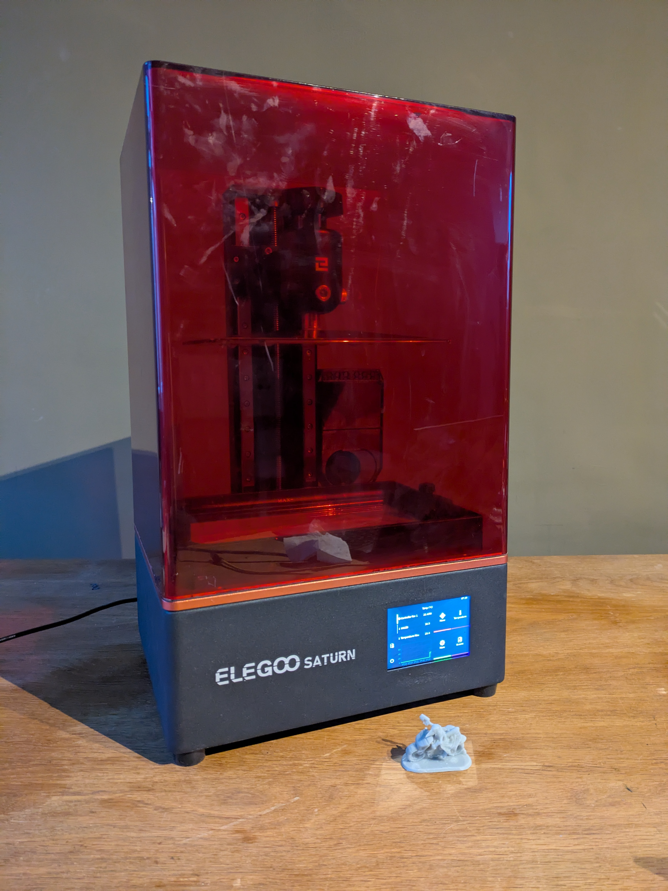
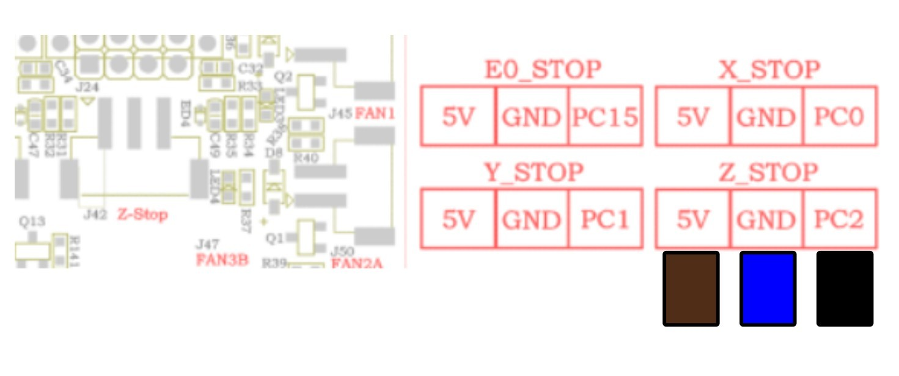
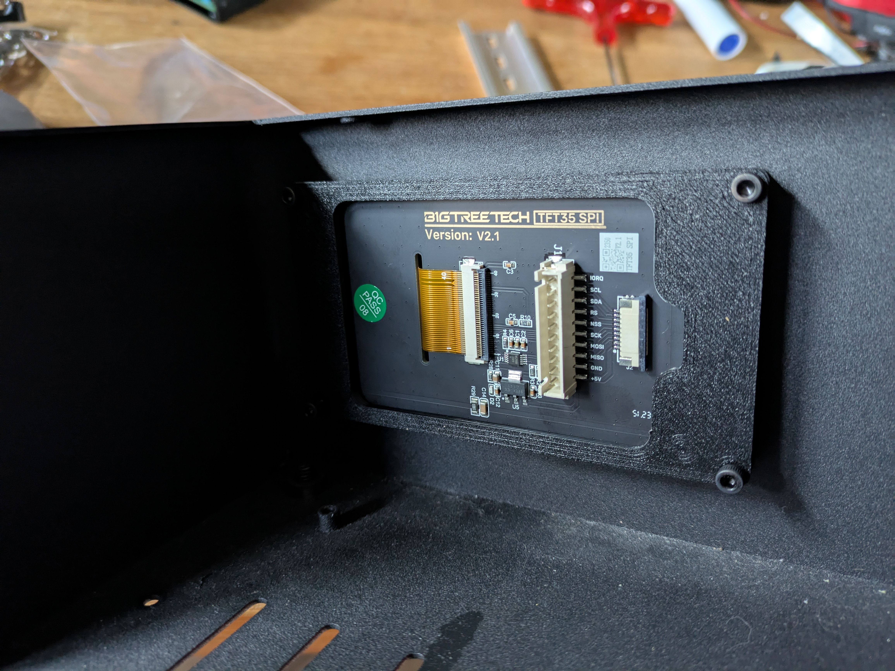
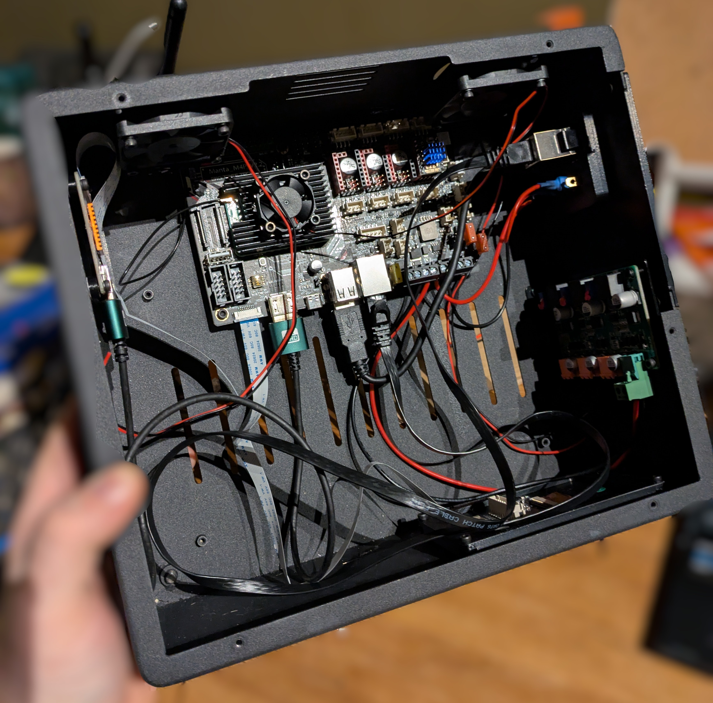
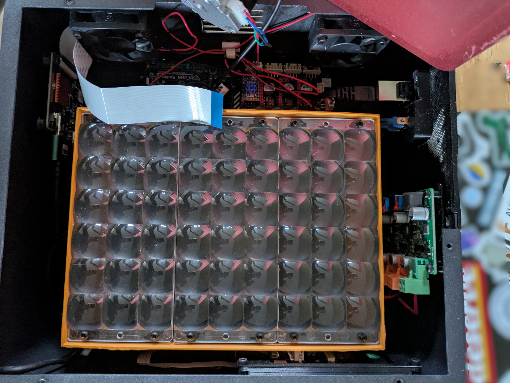
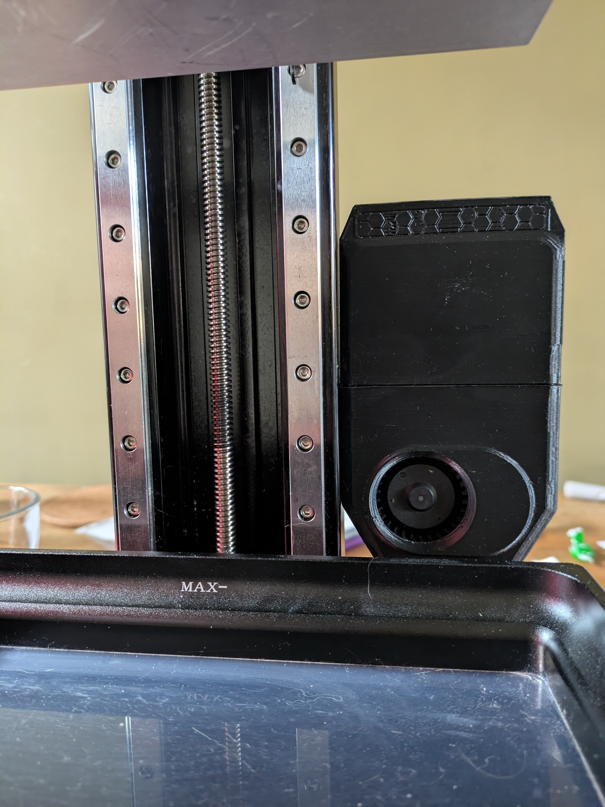

# Elegoo Saturn 1 with Klipper

## Table of contents

1. [What and why?](#1-what-and-why)
2. [Bill of materials](#2-bill-of-materials)
3. [Hardware setup](#3-hardware-setup)
4. [Software setup](#4-software-setup)
5. [Addons](#5-addons)
6. [Troubleshooting](#6-troubleshooting)
7. [Next steps](#7-next-steps)

## 1. What and why?

### What?
**Elegoo Saturn 1 resin printer with Klipper onboard.**

Based on a donor printer, with or without a working screen, neatly packed in the stock enclosure. 
The older resin printers are dirt cheap and widely available, especially with a busted screen. That is, an easy and cost-effective starting point. 

### Why?
**I think, proprietary printers suck.** 

I've been working with resin printers for a while now, and the way any upgrade is either buying a new model, or perform complicated hacks is what I really disliked about the tech. Which is not the case with hobby-level FDM. 

Naturally, when I found out the [PR to get Klipper support for mSLA](https://github.com/Klipper3d/klipper/pull/6575) exists, I got an old Saturn and started tinkering. 

### Before you start
The Elegoo Saturn 1 was released in 2020 with a 8.9" 4k display onboard. By no means it is a modern printer with ultra-high resolution. That is, to set up the expectations, be aware this conversion might not suite your use case. Especially given the amount of tinkering required to make it work. As a cherry on top, just the electronics with a screen could easily cost the same as the new Elegoo Saturn 4. Not that I want to discourage you - this is an awesome project. Just be sure you understand what you are going to step into.

> ⚠️ And while we're on it, proceed at your own risk. I am not responsible for property damage, injuries, or any unwanted consequences occuring from following this manual.    ⚠️ It worked on my machine, that's the best I can tell. You have been warned.

## 2. Bill of materials

### Required
|Name|Qty|Note|
|-|-|-|
|[BTT Manta M4P](https://biqu.equipment/products/manta-m4p-m8p?variant=39847241056354)|1| |
|[Raspberry CM4](https://www.raspberrypi.com/products/compute-module-4/?variant=raspberry-pi-cm4001000)|1|**4Gb + Wifi + Lite recommended.** I was not able to use BTT CB1, due to troubles with configuring display with the proper overlay. |
|[CM4 cooling](https://www.waveshare.com/product/cm4-heatsink-b.htm) |1|Passive should work, active won't hurt for longer print jobs. |
|[TMC2209 stepper driver](https://biqu.equipment/products/bigtreetech-tmc2209-stepper-motor-driver-for-3d-printer-board-vs-tmc2208?_pos=1&_sid=1e5b3ba84&_ss=r) |1| |
|[PJ089Y2V5 8.9" mono screen](https://aliexpress.com/item/1005004398973695.html) |1|It is also possible to use TM089CFSP01 with the same config. |
|[HDMI driver for the display](https://aliexpress.com/item/1005004398973695.html) |1| |
|[BTT TFT35 SPI](https://biqu.equipment/products/bigtreetech-tft35-spi-v2-1-touchscreen-io2can-module?_pos=3&_sid=ebd32c34f&_ss=r&variant=40214263529570) |1|While not the best for the job, it fits best to the stock case. |
|HDMI cable |1|15-30cm, for connecting the HDMI driver |
|USB A to USB C cable |1|15-30cm, for connecting the HDMI driver. |
|KCD1 switch |1||
|5.5x2.5 power socket |1||
|[Printed parts]()|1||
|M3x40 screws|4||

### Reused from a donor printer
|Name|Qty|Note|
|-|-|-|
|NEMA17 stepper motor|1||
|Z axis kinematics|1||
|Z endstop|1|You will need to change the pinout of the connector.|
|Enclosure|1||
|Power supply unit|1||
|UV LED array with driver|1||
|Buildplate|1||
|Resin vat|1||
|Glass under the screen|1|Can be purchased with the screen, but reusing is slightly cheaper.|
|Enclosure fans|2||
|Most of the fasteners|1||

### Optional
|Name|Qty|Note|
|-|-|-|
|USB keystone |1||
|Temperature sensor|1| PT1000 is configured, it is a good option for monitoring the UV LED array temperature.|
|RJ45 keystone |1| |
|[SUNON 24V DC 0.65W 50x50x15mm](https://aliexpress.com/item/1005007898152811.html) |2|Stock fans can be reused.|
|[Nevermore Nano](https://www.printables.com/model/1176031-nevermore-v6-nano-single-fan-micro)|1|Any coal filter with fan will do. Strongly advised, resin fumes are a serious matter.|

## 3. Hardware setup
### Preparation
#### Screen
Important thing to consider when getting a Saturn is the screen model.
Originally, Saturns were shipped with either PJ089Y2V1 or TM089CFSP01.

> ⚠️ PJ089Y2V5 has a different pinout from PJ089Y2V1, so HDMI driver will also be different.

#### Printed parts
ABS or ASA would be best to use. Little to no load expected on the printed parts, however there might be some relatively high temperatures around the UV LED array. 

#### Z-endstop
[EE-SX674](https://www.ia.omron.com/data_pdf/cat/ee-sx47_67_ds_e_13_4_csm483.pdf) with 3 pins connector should be wired as 

Brown (GND)  
Blue (5V)  
Black (Signal)

    

### Disassembly 
From a donor printer, only enclosure, UV LED with driver and kinematics are needed. Screen only if it can be used with HDMI driver. 

### Assembly
0. Take the bottom part of the enclosure.
1. Install the BTT TFT35 using the printed mount. 

    

2. Insert the printed slot caps.
3. Install the mainboard using the printed mount.
4. Install the HDMI driver sing the printed mount.
5. Rotate and install the LED driver.

    

6. Connect to the mainboard:
    + HDMI driver
    + LED driver
    + Power
    + BTT TFT35 SPI
    + Fans
    + Keystones, if used 

> ⚠️ This is the point where I suggest configuring the firmware, since after the UV LED is installed, the access to microsd card slot is tight, as well to the connectors.

7. Connect the UV LED array to the LED driver, then using the printed spacers and M3x40 screws install it in place.

    

> On this photo the stepper driver is in the wrong slot. It should be Z. Other than that, this is how everything should look at this point.
8. Connect to the mainboard:
    + Stepper motor
    + Z endstop
9. Connect the screen.
10. Screw the top part of the enclosure to the bottom. 
11. Calibrate as per [this guide](https://github.com/sn4k3/klipper-msla?tab=readme-ov-file#4-calibrate)
12. Make a test run as described in [this guide](https://github.com/sn4k3/klipper-msla?tab=readme-ov-file#5-final-run).

## 4. Software setup
### Firmware
Best starting point is [sn4k3/klipper-msla](https://github.com/sn4k3/klipper-msla). 
When following the manual, keep in mind the MCU is different, refer to [printer.cfg](/Software/printer.cfg). 

> ⚠️ In the configuration the safe z move is set to 180, however it's totally possible to go up to 200 safely. 

If you plan to use BTT TFT35, the setup process is [described here](https://github.com/stadie/btt_tft35spi_rpi). 

### Slicer settings
Import Prusaslicer [config.ini](/Software/config.ini).

### Slicing
1. Slice with [Prusaslicer](https://www.prusa3d.com/page/prusaslicer_424/) to .sl1 file.
2. Open with [UVTools](https://github.com/sn4k3/UVtools).
3. File -> Convert to -> Klipper -> Klipper (mono).
4. Extract .zip to your virtual_sdcard, i.e. **~/printer_data/gcodes**.
5. Start the print from the Mainsail.

## 5. Addons
### Filter
As a big fan of [Nevermore3d](https://github.com/nevermore3d) filters I was quite sad Micro won't fit in the stock case. 

That's why I made remix for a half-width Micro. [Nano v6](https://www.printables.com/model/1176031-nevermore-v6-nano-single-fan-micro) is available on Printables. I simply drilled a hole in a vertical profile and screwed the filter with an M3 screw.

    

## 6. Troubleshooting
### Internal error on command:"M1451"
Likely, an image is missing. Check if all the images for the layers are present. 
## 7.  Next steps
At some point I would love to design the same thing without the need of a donor printer. Pretty sure it's not a nearby future matter, but that is in my backlog.